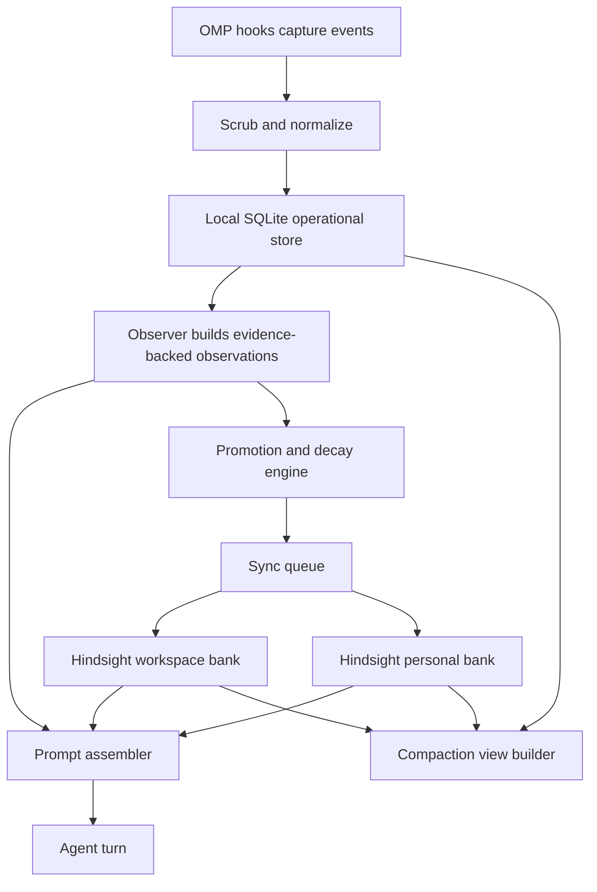

# Oh-My-Pi unified memory plugin design

> One OMP-native plugin, two storage tiers, one orchestrator.

## Goal

Build a single Oh-My-Pi memory plugin that combines the strongest parts of:

- `pi-continuous-learning`
- `LaPis`
- `pi-observational-memory`
- OMP's built-in Hindsight integration

without running multiple competing memory runtimes at once.

## Decision

Use a **hybrid local-first architecture**:

- **Local SQLite sidecar** owns operational memory and indexing.
- **Hindsight** owns durable semantic memory and reasoning.
- **One OMP-native orchestrator** owns hooks, injection, promotion, compaction integration, and sync.

This is optimized first for **one user shared across multiple OMP workspaces/projects**.

## Why not compose the four systems directly

All four systems already claim overlapping ownership.

| System | What it already owns | Evidence |
|:-------|:---------------------|:---------|
| `pi-continuous-learning` | session hooks, prompt injection, instinct/fact storage, background analysis | `packages/pi-continuous-learning/src/index.ts`, `src/storage.ts`, `README.md` |
| `pi-observational-memory` | observation lifecycle, compaction summary ownership, branch-local session memory | `src/index.ts`, `src/runtime.ts`, `README.md` |
| `LaPis` | SQLite persistence, automatic context injection, tool surface, code/doc indexing | `extensions/memory-layer/index.ts`, `schema.sql`, `README.md` |
| Hindsight | retain/recall/reflect, semantic retrieval, durable observations, mental models, directives, MCP/API | `hindsight_api/engine/interface.py`, `mcp_tools.py`, `engine/consolidation/consolidator.py`, `README.md` |

If they are run side-by-side, conflicts are structural:

- duplicate prompt injection
- duplicate observation and reflection pipelines
- conflicting schedulers
- conflicting storage ownership
- duplicated or contradictory durable memories
- overlapping tool namespaces

## Architecture

### Storage tiers

#### Tier A — local operational store

Use local SQLite for:

- workspaces and session registry
- raw event journal
- observation chunks
- code/doc indexes
- trust and churn metadata
- pending sync jobs
- fast local caches

This tier is derived mainly from **LaPis**.

#### Tier B — semantic memory store

Use Hindsight for:

- durable facts
- durable observations
- recall
- reflect
- mental models
- directives
- temporal and graph-aware retrieval

This tier is derived from **Hindsight**.

## Ownership model

The unified plugin must be the **only runtime** that owns:

- OMP hooks
- prompt/context injection
- compaction integration
- background scheduling
- sync policy
- tool namespace
- promotion and decay decisions

The source projects contribute logic and data-model ideas, not live parallel runtimes.

## Component responsibilities

### Keep from `pi-continuous-learning`

Reuse these ideas directly:

- secret scrubbing before persistence
- confidence scoring
- passive decay
- contradiction detection
- promotion and graduation thresholds

Strong evidence:

- `src/scrubber.ts`
- `src/confidence.ts`
- `src/instinct-contradiction.ts`
- `src/graduation.ts`

### Keep from `pi-observational-memory`

Reuse these ideas directly:

- asynchronous observer pattern
- evidence-backed observation ids
- branch/session continuity model
- mechanical compaction assembly
- relevance-aware pruning

Strong evidence:

- `src/runtime.ts`
- `src/hooks/observer-trigger.ts`
- `src/hooks/compaction-hook.ts`
- `README.md`

### Keep from `LaPis`

Reuse these ideas directly:

- SQLite-first local ergonomics
- workspace isolation
- trust scoring tied to code change
- code/doc indexing
- compact result encoding

Strong evidence:

- `schema.sql`
- `extensions/memory-layer/index.ts`
- `parse-code.js`
- `doc-indexer.js`
- `wire-format.js`

### Keep from Hindsight

Reuse these capabilities directly:

- retain / recall / reflect
- bank isolation
- temporal + semantic + graph retrieval
- durable observations
- mental models
- directives
- local MCP / API deployment options

Strong evidence:

- `hindsight_api/engine/interface.py`
- `hindsight_api/mcp_local.py`
- `hindsight_api/mcp_tools.py`
- `hindsight_api/engine/consolidation/consolidator.py`
- `hindsight_api/engine/reflect/agent.py`

## What must be discarded

Do not carry forward these live behaviors:

- `LaPis` automatic prompt injection
- `pi-continuous-learning` direct instinct injection as a separate subsystem
- `pi-continuous-learning` separate file-based instinct/fact store as a second truth source
- `pi-observational-memory` session tree as the only durable memory store
- multiple analyzers or dream/compaction schedulers running independently
- broad, overlapping tool surfaces like `memory-*`, `instinct_*`, and duplicate `recall`-style tools

## Runtime flow

### 1. Capture

Use one OMP-native hook path to capture:

- user turns
- assistant turns
- tool calls and results
- edited files or symbols
- errors and corrections
- compaction boundaries

Before any write, pass data through the `pi-continuous-learning` scrubber.

### 2. Observe

Create small operational observations from recent session activity.

Properties:

- evidence-backed
- timestamped
- relevance-ranked
- branch/session scoped
- still local, not yet durable semantic memory

This is the `pi-observational-memory` idea, but backed by SQLite instead of only the session tree.

### 3. Retrieve for each turn

Inject from exactly two sources:

1. **local short-term continuity** from operational observations
2. **durable semantic memory** from Hindsight
   - current workspace bank first
   - personal bank second

No other subsystem injects memory into the prompt.

### 4. Promote

A promoter decides which local observations should graduate:

- stable factual knowledge → Hindsight `retain`
- recurring themes → Hindsight durable observations or mental-model refresh
- durable user rules → Hindsight directives
- weak/noisy items → remain local and decay out

This is where confidence, contradiction, and decay logic belong.

### 5. Compact

Compaction is a **view**, not the source of truth.

Rules:

- assemble mechanically from kept local observations plus durable reflections
- preserve evidence ids
- never rewrite a summary-of-a-summary
- never let compaction become a second semantic database

### 6. Sync

Hybrid mode means:

- capture always succeeds locally first
- Hindsight sync is queued and idempotent
- failed remote/embedded Hindsight writes never block session capture
- replay uses content hashes and source ids to prevent duplicate retain

## Bank strategy

For one user across multiple OMP projects/workspaces:

### Personal bank

Stores:

- cross-project preferences
- durable habits
- stable user identity facts
- durable directives that should apply across projects

### Workspace bank

Stores:

- project-specific facts
- architectural decisions
- current project constraints
- project-specific observations and reflections

### Retrieval order

1. workspace bank
2. personal bank

### Promotion rule

- project-specific memory stays in the workspace bank
- repeated cross-project patterns can graduate into the personal bank

## Local SQLite schema

Keep the local store operational and narrow.

### Core tables

- `workspaces`
- `sessions`
- `raw_events`
- `observations`
- `observation_sources`
- `patterns`
- `trust_links`
- `code_repos`
- `code_symbols`
- `doc_sections`
- `sync_queue`
- `settings_state`

### Separation rule

| Local SQLite only | Hindsight only |
|:------------------|:---------------|
| raw events | durable facts |
| observation chunks | durable observations |
| code/doc index | mental models |
| trust/churn metadata | directives |
| sync queue | recall / reflect reasoning |
| fast startup caches | cross-memory semantic retrieval |

## Tool surface

Keep v1 intentionally small.

### Recommended tools

- `memory_remember`
- `memory_recall`
- `memory_explain`
- `memory_pin`
- `memory_status`
- `memory_sync`

### Avoid in v1

Do not reproduce LaPis's large tool surface immediately. Code analysis and doc indexing can still exist locally, but they should not explode the memory tool namespace before the core memory ownership model is stable.

## Conflict prevention rules

These are mandatory invariants.

1. One captured event produces one canonical local record.
2. One turn gets one memory injection pass.
3. One promoted item maps idempotently to one Hindsight item.
4. Compaction never paraphrases preserved evidence.
5. Failed Hindsight sync never drops local memory.
6. Code churn may lower trust, but must not silently delete durable memory.
7. No second subsystem may inject context outside the unified orchestrator.

## Migration and import strategy

Compatibility should be **import-only**, not permanent dual-write.

### Import sources

- LaPis SQLite observations, trust metadata, and indexes
- `pi-continuous-learning` instincts and facts
- `pi-observational-memory` observation/reflection artifacts where recoverable
- existing Hindsight banks

### Avoid

- live dual-write into old and new stores
- permanent backward-compatibility runtimes
- mixing old prompt injectors with the new orchestrator

## Better-than-source improvements

The unified plugin should improve on the originals by adding:

1. one truth per layer
2. one injection path
3. offline-first capture
4. code-aware trust decay before recall and promotion
5. cross-project personal memory without project pollution
6. deterministic dedup with content and evidence hashing
7. scrub-before-write privacy guarantees
8. compact tool surface with clearer semantics

## V1 delivery order

1. OMP-native plugin shell
2. local SQLite store and scrubbed event capture
3. observer and local operational retrieval
4. single prompt injection path
5. Hindsight promotion queue
6. workspace + personal bank merged retrieval
7. code/doc trust indexing
8. importers

## Non-goals for v1

- multi-user shared-team memory
- broad LaPis-style analysis tool parity
- full Hindsight replacement
- live compatibility with the original three extensions
- multiple independent schedulers

## Source-grounded evidence summary

### `pi-continuous-learning`

- `packages/pi-continuous-learning/src/index.ts`
- `packages/pi-continuous-learning/src/storage.ts`
- `packages/pi-continuous-learning/src/confidence.ts`
- `packages/pi-continuous-learning/src/scrubber.ts`

### `LaPis`

- `LaPis/extensions/memory-layer/index.ts`
- `LaPis/schema.sql`
- `LaPis/parse-code.js`
- `LaPis/doc-indexer.js`
- `LaPis/wire-format.js`

### `pi-observational-memory`

- `pi-observational-memory/src/index.ts`
- `pi-observational-memory/src/runtime.ts`
- `pi-observational-memory/src/hooks/compaction-hook.ts`
- `pi-observational-memory/src/hooks/compaction-trigger.ts`

### Hindsight

- `hindsight-api-slim/hindsight_api/engine/interface.py`
- `hindsight-api-slim/hindsight_api/engine/consolidation/consolidator.py`
- `hindsight-api-slim/hindsight_api/engine/reflect/agent.py`
- `hindsight-api-slim/hindsight_api/mcp_local.py`
- `hindsight-api-slim/hindsight_api/mcp_tools.py`

## Final recommendation

Use Hindsight as the semantic memory authority, not as the raw session capture system.

Use SQLite as the operational memory authority, not as a second semantic engine.

Build one OMP-native plugin that owns the seams between them.
